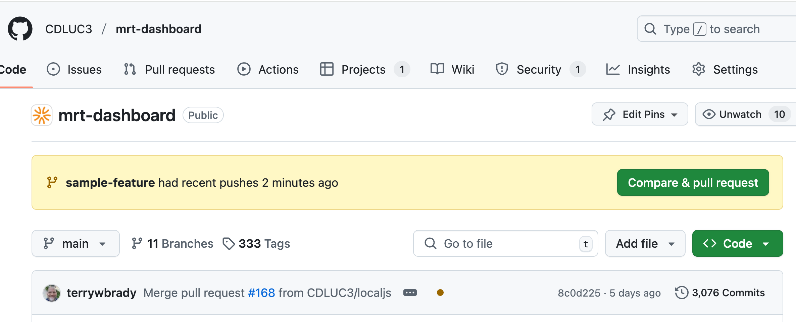
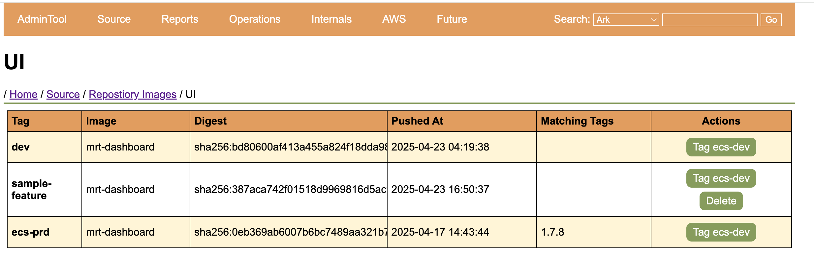
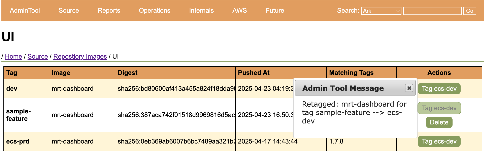
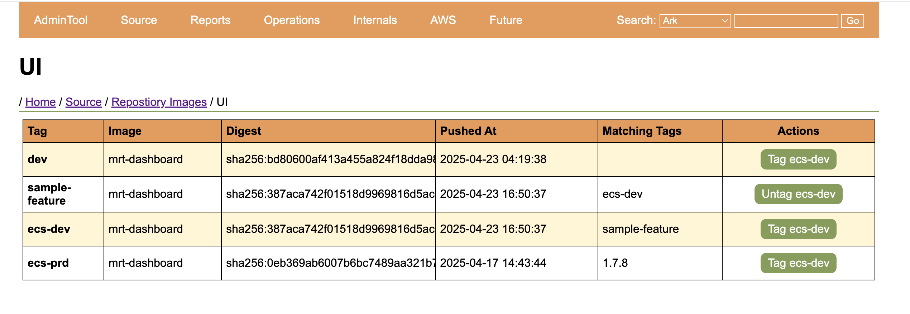
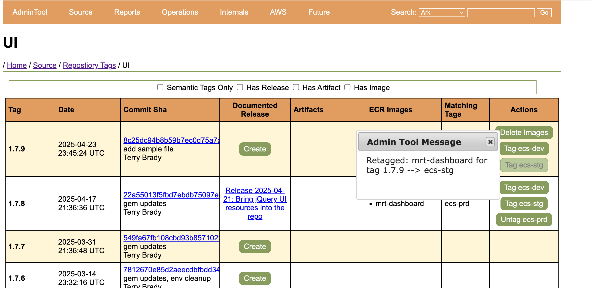
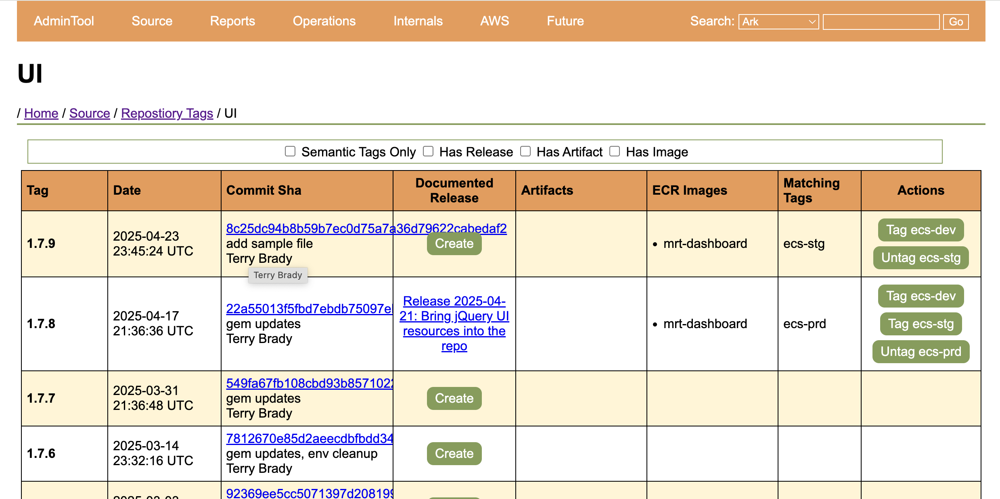
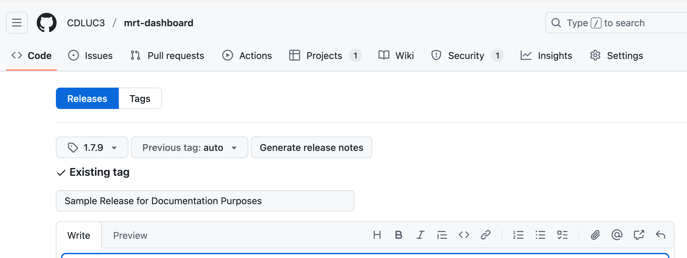
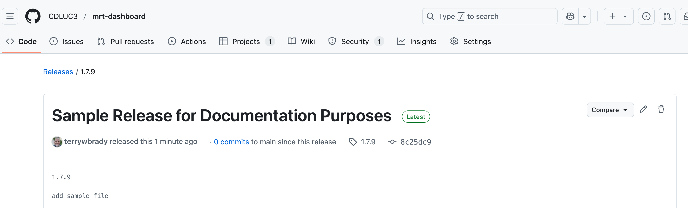
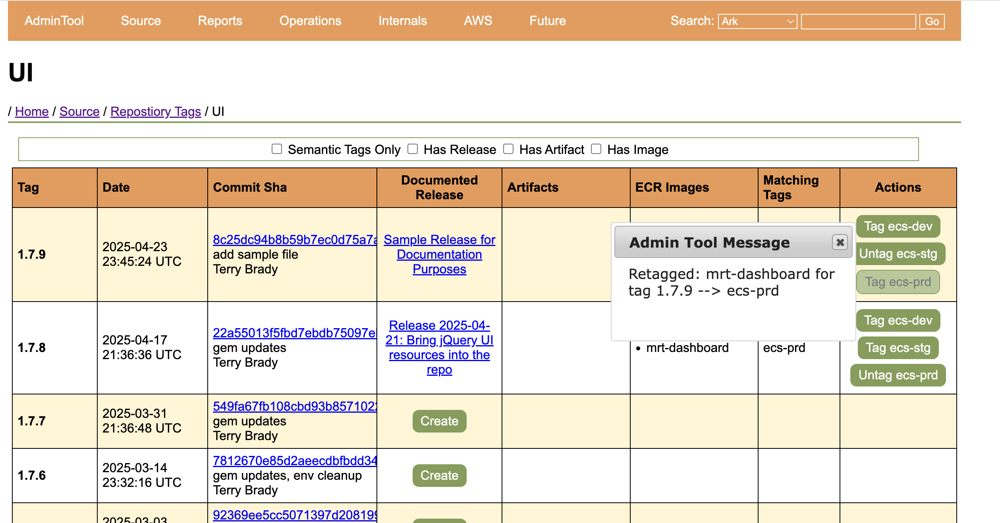

## Merritt Builds for ECS

- [View as Slides](https://merritt.uc3dev.cdlib.org/present/ecs-deploy/build.html#/)
- [Presentation Source](https://github.com/CDLUC3/mrt-admin-sinatra/blob/main/present/deploy/build.md)
---

## Goal: Create a feature Branch for Merritt UI, Depoloy to ECS Dev

----

## Create feature branch `sample-feature`

----



----

### CodeBuild runs in the background...
- image mrt-dashboard:sample-feature pushed to ECR

----

## In the Admin Tool, view Repository Images for Merritt UI

- since this is not associated with a tag, we must view the image listing

----



----

### Click `Tag ecs-dev`

----



----

### Reload Page

----

Note that a second tag has been assigned to the image


---

## Goal: Tag current code in Git in prepraration for deployment to Stage

----

By Merritt conventions, only tagged branches should be deployed to stage or prod

----

## Tag Git Branch with `1.7.9`

----

```
$ git tag 1.7.9
$ git push --tags
Total 0 (delta 0), reused 0 (delta 0), pack-reused 0
To github.com:CDLUC3/mrt-dashboard
 * [new tag]           1.7.9 -> 1.7.9
```

----

### CodeBuild Runs in the background...
- mrt-dashboard:1.7.9 is pushed to ECR

----

## View Repository Tags for Merritt UI

----


----

### Click `Tag ecs-stg`

----



----

### Reload Page

----



---

## Goal: Deploy to to ECS Prod

----

### Proposal: Require a documented "Release" for Production Deployments

----

Note that 1.7.9 does not have a documented release


----

### Click `Create` to document a release on GitHub

----



----

### Scroll and Click `Publish Release`

----



----

### Return to the Repository Tag listing

----

Note the published release info


----

### Click `Tag ecs-prd`

----



----

### Reload Page

----

Note that the ecs-prd image has migrated


---

## Goal: Rebuild docker image for unchanged code (Proposal)

----

In order to stay on top of image vulnerabilities, docker images should be republished weekly or monthly

----

## Trigger a CodePipeline to rebuild images (not artifacts) for a published tag

----

## A new pipeline will be needed

- Parameters
  - tag name
  - build suffix

----

### CodeBuild runs in the background
- mrt-dashboard:1.7.9-docker-250424 is published to ECR

----

- Merritt Admin Tool will need to know that this is an image that we derived from tag 1.7.9
- User will have the ability to re-tag the image with ecs-stg or ecs-prd
