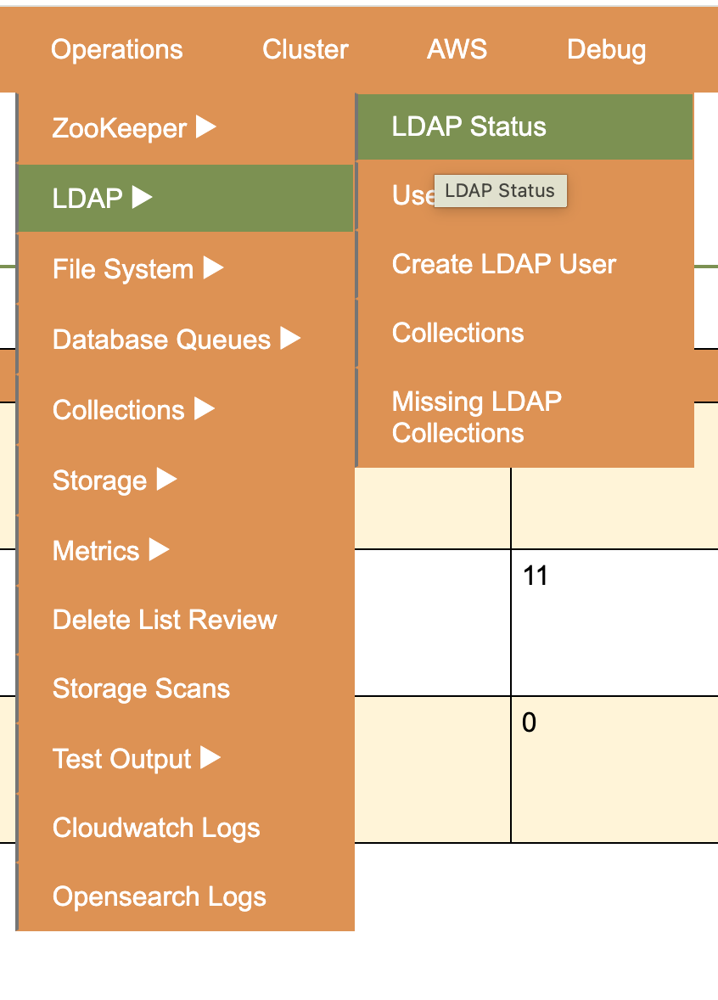

# Merritt Admin Exec Command



Route
```ruby
      app.get '/infra/ecs/ldap-status' do
        UC3Resources::ServicesClient.new.execute_command('/ldap-status.sh')
        sleep 30
        redirect '/ops/s3-reports/download?report=ldap/status.txt'
      end

```

## Ruby invocation (`docker exec` equivalent)

Execute command returns a web socket which was difficult to parse.

Note that it was easy to parse output using the aws client + a shell script.

```ruby
    def execute_command(command, service: 'merritt-ops')
      return unless enabled

      begin
        task_arn = @client.list_tasks(cluster: UC3::UC3Client.cluster_name, service_name: service).task_arns.first
        @client.execute_command(
          cluster: UC3::UC3Client.cluster_name,
          task: task_arn,
          container: service,
          command: command,
          interactive: true
        )
      rescue StandardError => e
        logger.error("Error executing command: #{e.message}")
      end
    end
```

## ldap-status.sh

This runs in the merritt-ops container which has access to the aws cli and other developer tools.

This container is being used to orchestrate work in other containers.

```bash
#! /bin/bash

header() {
  svc=$1
  echo "================"
  echo "  Service: $svc"
  echo "================"
}

echo "LDAP Status as of $(TZ='America/Los_Angeles' date)" > /var/www/html/ldap.txt

export ECS_STACK_NAME=mrt-${MERRITT_ECS}-stack

for svc in ldap ldapreplica
do
  header $svc >> /var/www/html/ldap.txt
  ldap=$(aws ecs list-tasks --cluster $ECS_STACK_NAME --service-name $svc --query taskArns --output text)

  unbuffer aws ecs execute-command --cluster $ECS_STACK_NAME --task $ldap \
    --container $svc --command "/opt/opendj/merritt-status.sh" --interactive >> /var/www/html/ldap.txt
done

aws s3 cp /var/www/html/ldap.txt "s3://${S3REPORT_BUCKET}/ldap/status.txt"
cat /var/www/html/ldap.txt
```

## merritt-status.sh

This runs in our LDAP container which has fewer tools installed.

```bash
#!/bin/bash
bin/status --bindDN "cn=Directory Manager" --bindPassword $ROOT_PASSWORD
```