## Merritt Tagging and Build Rules

- [Presentation](https://merritt.uc3dev.cdlib.org/present/tagging/build.html#/)
- [Presentation Source](https://github.com/CDLUC3/mrt-admin-sinatra/blob/main/present/tagging/build.md)

---

## 4 Types of Assets

- Java Libraries (Jars)
- Java Services (War)
- Ruby Libraries
- Ruby Services

----

## 5 Scenarios

- Source Code Actions
  - Push to main
  - Push to feature branch
  - Tag resource
- Events
  - Daily rebuild (main)
  - Rebuild image from tagged artifacts

---

## Java Libraries (Jar)

```mermaid
graph LR
  Commit(👤 Git Commit)
  Commit --> CodeBuild
  CodeBuild --> CodeArtifact
```

---

## Java Services (War)

```mermaid
graph LR
  Commit(👤 Git Commit)
  Daily(👤 Daily Build)
  Tag(👤 Git Tag)
  Rebuild(👤 Rebuild Image)
  Admin(👤 Merritt Admin)
  ECS(ECS Deploy from ECR)
  Commit --> CodeBuild
  Tag --> CodeBuild
  Daily --> CodeBuild
  CodeBuild --> CodeArtifact
  CodeArtifact --> ECR
  Rebuild --> ECR
  CodeArtifact -.-> Rebuild
  Admin --> ECS
  ECR -.-> ECS
```

