## Merritt Tagging and Build Rules

- [View as Slides](https://merritt.uc3dev.cdlib.org/present/tagging/build.html#/)
- [Presentation Source](https://github.com/CDLUC3/mrt-admin-sinatra/blob/main/present/tagging/build.md)

---

## 4 Types of Assets

- Java Libraries (Jars)
- Java Services (War)
- Ruby Libraries
- Ruby Services

----

## 5 Scenarios

- Source Code Actions
  - Push to main
  - Push to feature branch
  - Tag resource
- Events
  - Daily rebuild (main)
  - Rebuild image from tagged artifacts

---

## Java Libraries (Jar)

```mermaid
graph LR
  Commit(👤 Git Commit)
  Commit --> CodeBuild
  CodeBuild --> CodeArtifact
```



----

### Notes

- Merritt Java libraries are published as snapshots.  These snapshots are updated.
- Merritt Java Libraries are versioned via the version tag within the libraries pom.xml file.
- When breaking changes are made to a library, the developer *should* create a new version.
- Merritt services will explicitly update pom files to pull a new published snapshot of a library.

----

### Commit/Tag CodeBuild Actions
- `main` branch
  - Artifact: `library.version-SNAPSHOT`
- `branch` branch
  - Artifact: `library.version-SNAPSHOT`
  - must be configured in CodePipeline to track specific branches
- `tag` tag
  - tagging is not relevant for Merritt Java libraries

----

## Jar File Versioning

```
   <packaging>jar</packaging>
    <version>3.1-SNAPSHOT</version>
    <name>UC3-mrtcore</name>
```

----

## Update Jar File Version

The version is updated with the following command:
```
mvn release:update-versions
```

----

pom.xml for referring WAR file

```
   <properties>
      <merritt-zk.version>3.0-SNAPSHOT</merritt-zk.version>
      <merritt-cloud.version>3.1-SNAPSHOT</merritt-cloud.version>
      <merritt-core.version>3.1-SNAPSHOT</merritt-core.version>
      <merritt-bom.version>3.0-SNAPSHOT</merritt-bom.version>
    </properties>
```

---

## Java Services (War)

```mermaid
graph LR
  Commit(👤 Git Commit)
  Daily(👤 Daily Build)
  Tag(👤 Git Tag)
  Rebuild(👤 Rebuild Image)
  Admin(👤 Merritt Admin)
  ECS(ECS Deploy from ECR)
  Commit --> CodeBuild
  Tag --> CodeBuild
  Daily --> CodeBuild
  CodeBuild --> CodeArtifact
  CodeArtifact --> ECR
  Rebuild --> ECR
  CodeArtifact -.-> Rebuild
  Admin --> ECS
  ECR -.-> ECS
```



----

## Notes

- Snapshot artifacts can be overwritten
- Tagged artifacts cannot be overwritten
- Tagged ARTIFACTS are only built once
- Docker IMAGES derived from an ARTIFACT can be re-built

----

### Commit/Tag CodeBuild Actions
- `main` branch
  - Artifact: `subservice.version-SNAPSHOT.war`
  - ECR Image: `subservice:dev`
- `branch` branch
  - Artifact: `subservice.branch-SNAPSHOT`
  - ECR Image: `subservice:branch`
- `tag` tag
  - Artifact: `subservice.TAG`
  - ECR Image: `subservice:tag`

----

### Auto Deployment

Merritt Java services can be configured to auto-deploy to ECS Dev from the main branch

----

### Image Tagging Conventions

- Docker Image Tagged for ECS Deployment
  - `subservice:ecs-dev`
  - `subservice:ecs-stg`
  - `subservice:ecs-prd`

----

### Image Rebuild Conventions

When the underlying image for a published service is updated, the following will be recreated in ECR.

- Docker Image Patched After Code Deployment of tag `tag`
  - `subservice:tag-YYMMDD`

---

## Ruby Libraries (Gem)

```mermaid
graph LR
  Commit(👤 Git Commit)
```



----

## Notes

- Merritt Gems are not published as artifacts.
- Merritt Gems should be assigned a new semantic tag with each revision
- Merritt Gems are referenced with a source code link in the Gemfile.

----

### Commit/Tag CodeBuild Actions

- None

----

### Gemfile references to a library version
```
gem 'mrt-zk', git: 'https://github.com/CDLUC3/mrt-zk.git', tag: '2.4.6'
```


---

## Ruby Services

```mermaid
graph LR
  Commit(👤 Git Commit)
  Daily(👤 Daily Build)
  Tag(👤 Git Tag)
  Rebuild(👤 Rebuild Image)
  Admin(👤 Merritt Admin)
  ECS(ECS Deploy from ECR)
  Commit --> CodeBuild
  Tag --> CodeBuild
  Daily --> CodeBuild
  CodeBuild --> ECR
  Rebuild --> ECR
  Admin --> ECS
  ECR -.-> ECS
```



----

## Notes

- Merritt Ruby code is published to ECR. 
- Merritt does not use CodeArtifact for Gems

----

### Commit/Tag CodeBuild Actions

- `main` branch
  - ECR Image: `subservice:dev`
- `branch` branch
  - ECR Image: `subservice:branch`
- `tag` tag
  - ECR Image: `subservice:tag`

----

### Auto Deployment

Merritt UI and Admin Tool will auto-deploy to ECS from the main branch

----

### Image Tagging Conventions

- Docker Image Tagged for ECS Deployment
  - `subservice:ecs-dev`
  - `subservice:ecs-stg`
  - `subservice:ecs-prd`

----

### Image Rebuild Conventions

When the underlying image for a published service is updated, the following will be recreated in ECR.

- Docker Image Patched After Code Deployment of tag `tag`
  - `subservice:tag-YYMMDD`
